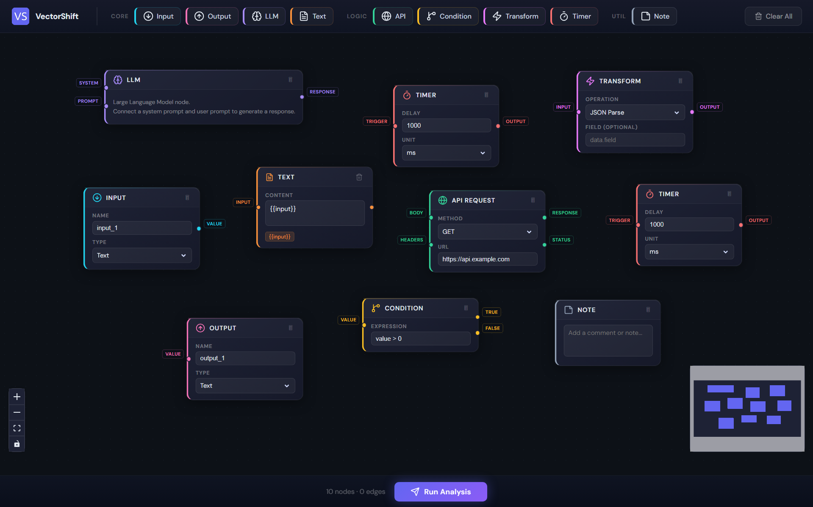

# ⚡ VectorShift

Frontend Technical Assessment Submission for **VectorShift**
Built by **Divyanshu Kumawat**

A node-based visual editor where users can drag, connect, and configure nodes to compose AI pipelines — then validate them against a FastAPI backend that checks node/edge counts and detects directed acyclic graph (DAG) structure.


---

# 🖥️ UI Preview



---

# 📸 Features at a Glance

* **9 node types** — drag from the toolbar to the canvas
* **Smart Text node** — auto-resizes as you type, detects `{{variable}}` patterns and creates live input handles
* **Full CRUD interactions** — create, connect, delete nodes/edges, reconnect edges by dragging endpoints
* **Pipeline analysis** — submit to backend for node count, edge count, and DAG validation
* **Clear All** — one-click (confirmed) canvas reset in the top-right toolbar
* **Polished dark UI** — unique accent colors per node type, smooth interactions throughout

---

# ⚙️ Key Capabilities

* **Reusable Node Architecture** — `BaseNode` abstraction enables rapid creation of new node types
* **Dynamic Handles** — Text node parses `{{variables}}` and generates input ports automatically
* **Graph Validation** — backend verifies DAG structure using DFS cycle detection
* **Edge Reconnection Logic** — implemented with ReactFlow v11 edge update handlers
* **Reusable UI Primitives** — consistent styling using `NodeInput`, `NodeSelect`, `NodeTextarea`
* **Global State Management** — Zustand store integrates cleanly with ReactFlow

---

# 🚀 Getting Started

## Prerequisites

* Node.js **16+**
* Python **3.8+**

---

## Frontend

```bash
cd frontend
npm install
npm start
```

Runs at

```
http://localhost:3000
```

---

## Backend

```bash
cd backend
pip install fastapi uvicorn pydantic
uvicorn main:app --reload
```

Runs at

```
http://localhost:8000
```

Both services must be running to use the **pipeline analysis feature**.

---

# 🗂️ Project Structure

```
Divyanshu_kumawat_technical_assessment/
├── frontend/
│   └── src/
│       ├── nodes/
│       │   ├── BaseNode.js
│       │   ├── inputNode.js
│       │   ├── outputNode.js
│       │   ├── llmNode.js
│       │   ├── textNode.js
│       │   └── customNodes.js
│       ├── App.js
│       ├── store.js
│       ├── ui.js
│       ├── toolbar.js
│       ├── submit.js
│       ├── draggableNode.js
│       └── index.css
├── backend/
│   └── main.py
├── README.md
```

---

# 🧩 Part 1 — Node Abstraction

### The Problem

The starter code had several node types written independently with duplicated code.
Each node implemented its own layout, styling, handles, and header logic.

This made:

* maintenance harder
* adding new nodes repetitive
* UI consistency difficult

---

### The Solution: `BaseNode`

`BaseNode` is a reusable component responsible for rendering the entire node structure.

```jsx
<BaseNode
  id={id}
  title="API Request"
  icon="🌐"
  accentColor="#34d399"
  inputs={[
    { id: 'body', label: 'body' },
    { id: 'headers', label: 'headers' },
  ]}
  outputs={[
    { id: 'response', label: 'response' },
    { id: 'status', label: 'status' },
  ]}
>
  {/* Custom JSX fields */}
</BaseNode>
```

---

### Reusable Field Components

| Component    | Purpose           |
| ------------ | ----------------- |
| NodeLabel    | Field label       |
| NodeInput    | Styled input      |
| NodeSelect   | Styled dropdown   |
| NodeTextarea | Multi-line editor |
| NodeRow      | Layout wrapper    |

---

### Node Types Implemented

| Node      | Purpose                          |
| --------- | -------------------------------- |
| Input     | Pipeline input source            |
| Output    | Pipeline output sink             |
| LLM       | Large language model interaction |
| Text      | Dynamic template text node       |
| API       | External API request             |
| Condition | Branch logic                     |
| Transform | Data transformation              |
| Timer     | Delay execution                  |
| Note      | Annotation node                  |

---

# 🎨 Part 2 — Styling

UI styling focuses on clarity and developer experience.

* **Canvas** uses a dark dot-grid background
* **Node cards** use subtle gradients and soft borders
* **Accent colors** visually differentiate node types
* **Typography** uses DM Sans for readability
* **Toolbar layout** separates node groups clearly

---

# 📝 Part 3 — Smart Text Node

### Auto-Resize

The Text node automatically resizes based on content.

```javascript
textarea.style.height = "auto"
textarea.style.height = textarea.scrollHeight + "px"
```

---

### Dynamic Variable Handles

The node scans for variables in this format:

```
{{variableName}}
```

Regex used:

```
/\{\{\s*([a-zA-Z_$][a-zA-Z0-9_$]*)\s*\}\}/g
```

Handles are dynamically generated on the left side for each variable.

---

# 🔌 Part 4 — Backend Integration

### Endpoint

```
POST /pipelines/parse
```

### Request

```json
{
  "nodes": [],
  "edges": []
}
```

### Response

```json
{
  "num_nodes": 4,
  "num_edges": 3,
  "is_dag": true
}
```

---

### DAG Detection

Cycle detection uses **DFS with 3-color marking**.

```
WHITE → unvisited
GRAY → currently exploring
BLACK → finished
```

Encountering a **GRAY node** means a cycle exists.

Time complexity:

```
O(V + E)
```

---

# 🗑️ Interaction Features

### Delete Node

Select node → press **Delete / Backspace**
or use the **delete icon** in the header.

---

### Delete Edge

Select edge → press **Delete**.

---

### Edge Reconnection

ReactFlow v11 uses:

* `onEdgeUpdateStart`
* `onEdgeUpdate`
* `onEdgeUpdateEnd`

---

### Clear All

Two-click confirmation button in the toolbar resets the canvas.

---

# 🛠️ State Management

State is handled with **Zustand**.

| Action        | Description    |
| ------------- | -------------- |
| addNode       | Add node       |
| deleteNode    | Remove node    |
| clearAll      | Reset canvas   |
| onNodesChange | Node updates   |
| onEdgesChange | Edge updates   |
| onConnect     | Add connection |
| onReconnect   | Reconnect edge |

---

# 📦 Dependencies

### Frontend

| Package   | Purpose          |
| --------- | ---------------- |
| React     | UI framework     |
| ReactFlow | Graph editor     |
| Zustand   | State management |

---

### Backend

| Package  | Purpose            |
| -------- | ------------------ |
| FastAPI  | Backend API        |
| Uvicorn  | ASGI server        |
| Pydantic | Request validation |

---

# ⭐ Highlights

This project demonstrates:

* Graph-based UI architecture
* Reusable React components
* Dynamic UI generation
* Graph algorithms
* Backend integration
* Modern UI/UX design

---

# 🔮 Future Improvements

Possible future enhancements:

* Pipeline execution engine
* Save/load pipelines
* Export pipelines as JSON
* Undo / redo history
* Node search & keyboard shortcuts
* Collaborative editing

---

# 👨‍💻 Author

**Divyanshu Kumawat**

Frontend Developer passionate about building interactive web applications and developer tools.

* Portfolio: https://divyanshukmwt.in
* GitHub: https://github.com/divyanshukmwt
* LinkedIn: https://www.linkedin.com/in/divyanshu-kumawat
* Email: [officialdivyanshu18@gmail.com](mailto:officialdivyanshu18@gmail.com)

---

# 🙌 Acknowledgements

Built as part of the **VectorShift Frontend Technical Assessment**.

---

# 📄 License

This project is open for **educational and portfolio purposes**.
